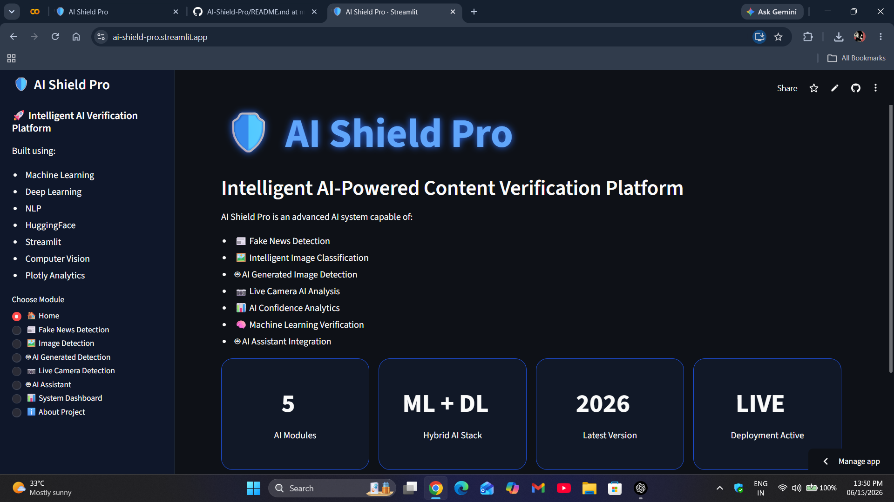
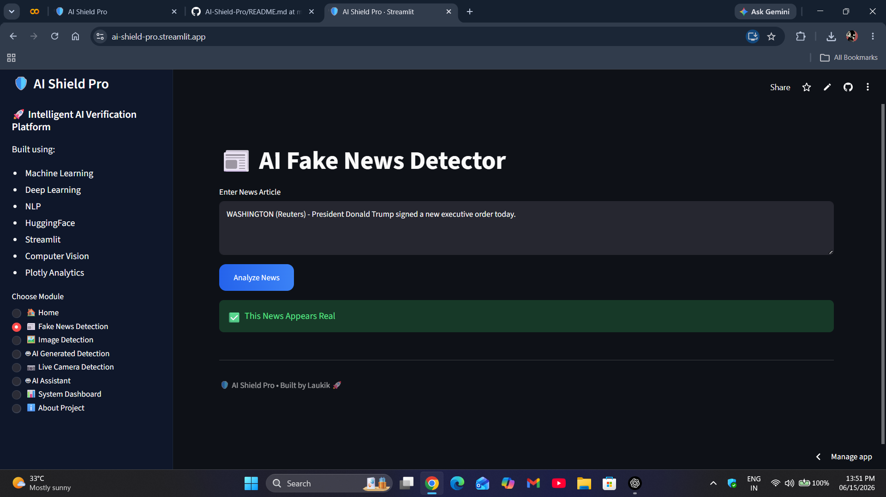
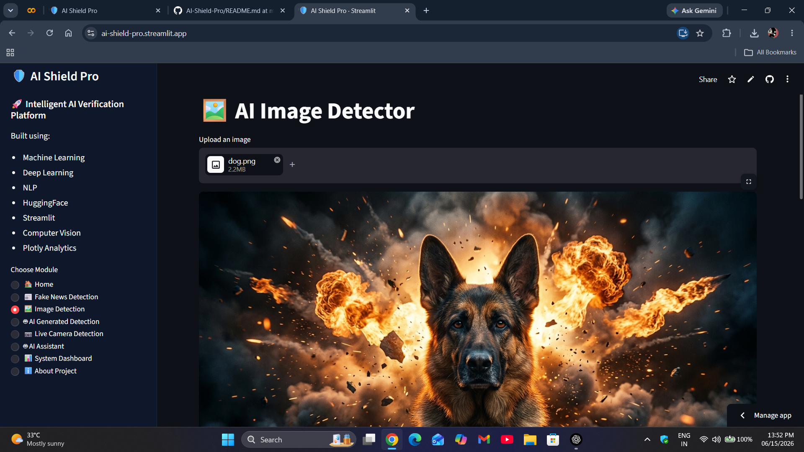
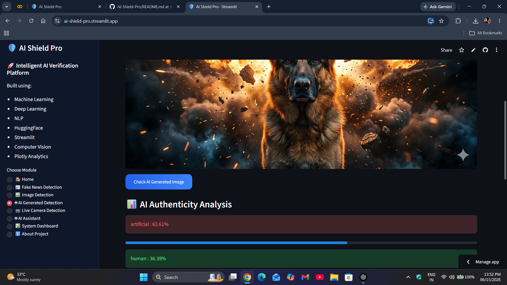

# 🛡️ AI Shield Pro

AI Shield Pro is an AI-powered content verification platform that helps users detect fake news, classify images, identify AI-generated content, and analyze media using Machine Learning and Deep Learning.

## 🚀 Live Demo

https://ai-shield-pro.streamlit.app

---

## ✨ Features

- 📰 Fake News Detection using Machine Learning
- 🖼️ Image Classification using Hugging Face Models
- 🤖 AI Generated Image Detection
- 📷 Live Camera Analysis
- 📊 Interactive Analytics Dashboard
- 🎨 Modern Streamlit UI

---

## 🛠️ Tech Stack

- Python
- Streamlit
- Scikit-Learn
- Hugging Face Transformers
- Pandas
- Plotly
- Computer Vision
- NLP

---

## 📂 Project Structure

AI-Shield-Pro

├── app.py

├── fake_news_detector.py

├── image_detector.py

├── deepfake_detector.py

├── fake_news_model.pkl

├── vectorizer.pkl

├── requirements.txt

└── README.md

---

## 🎯 Future Improvements

- Voice Deepfake Detection
- Real-Time News Verification
- Browser Extension
- AI Fact-Checking API
- Enterprise Dashboard

---

## 👨‍💻 Developer

Developed by Laukik

BTech Artificial Intelligence & Machine Learning

Symbiosis Skills and Professional University

---

## 📸 Project Screenshots

### 🏠 Home Page

### 📰 Fake News Detection

### 🖼️ Image Detection

### 🤖 AI Generated Detection

